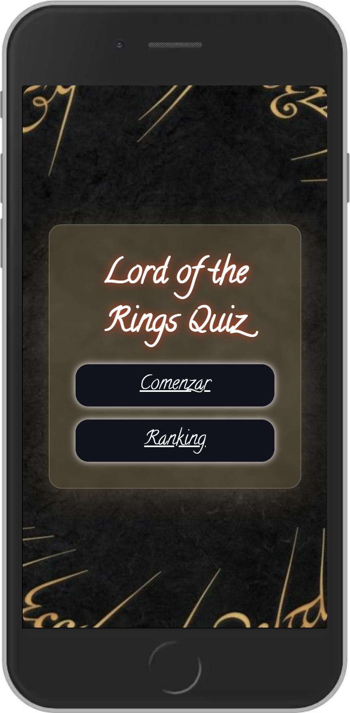
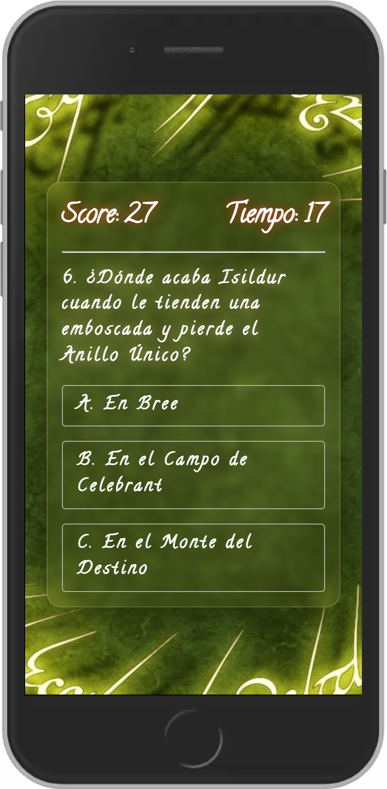
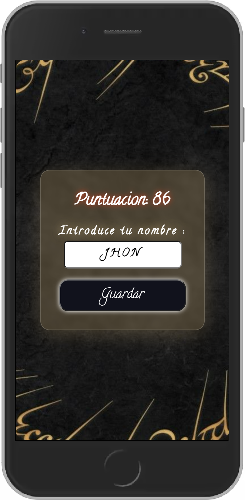
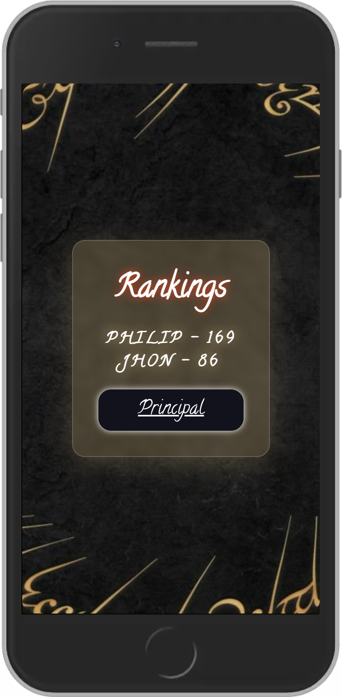

# Quiz against time - **[Go to the App](https://quiz-against-time.vercel.app/)**

This is a solution for the third challenge of Mouredev. **[Here is more information](https://github.com/mouredev/Monthly-App-Challenge-2022)**.

## Challenge Requirements

- The design is of free choice.
- The theme of the questions in the questionnaire will be freely chosen. It may be okay to follow the same topic (for example, questions about the "Harry Potter" universe).
- On the initial screen you can start playing or check the ranking of scores.
- The game will consist of 10 random questions with 3 answers and only one correct. It is recommended to create more than 10 questions so that the same ones do not always appear. Each time a question is answered, it will move on to the next.
- When marking an answer or the end of the time, it will be shown if the question has been correct or not, giving feedback on what the correct answer would be and navigating after a couple of seconds to the next screen.
- Score system:
  - Counter to 0 or wrong answer = 0 points.
  - Counter greater than 0 and correct answer = [seconds remaining] points. Ex: If there were 9 seconds left to finish the countdown and the question is correct, 9 points are assigned.
- Once question number 10 is finished, the final score will be shown on a new screen and a name must be entered to save it persistently (even if we close the app). Once these are done, the ranking screen will be displayed.
- The ranking screen shows the 10 best results and the saved name in order from highest to lowest. From this screen you can always navigate to the initial screen.
